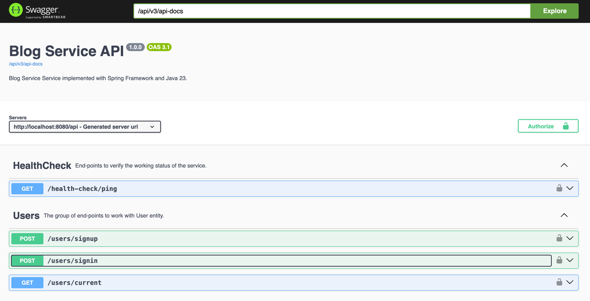
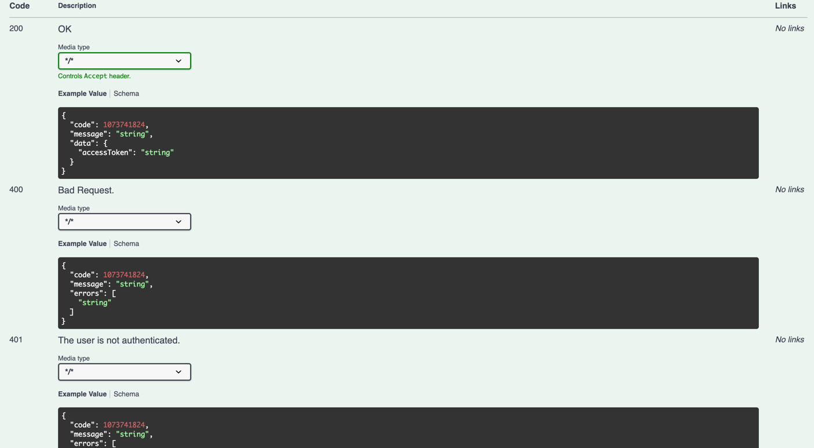
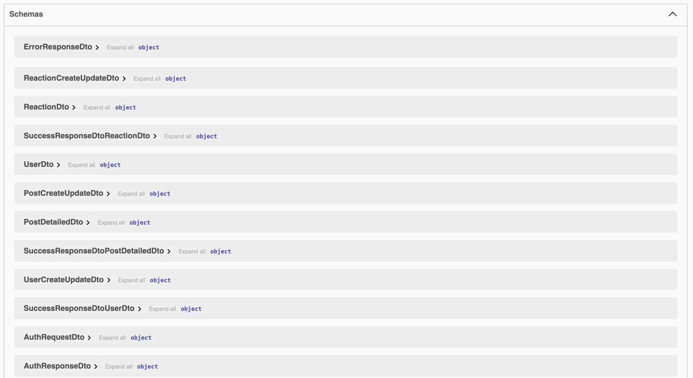
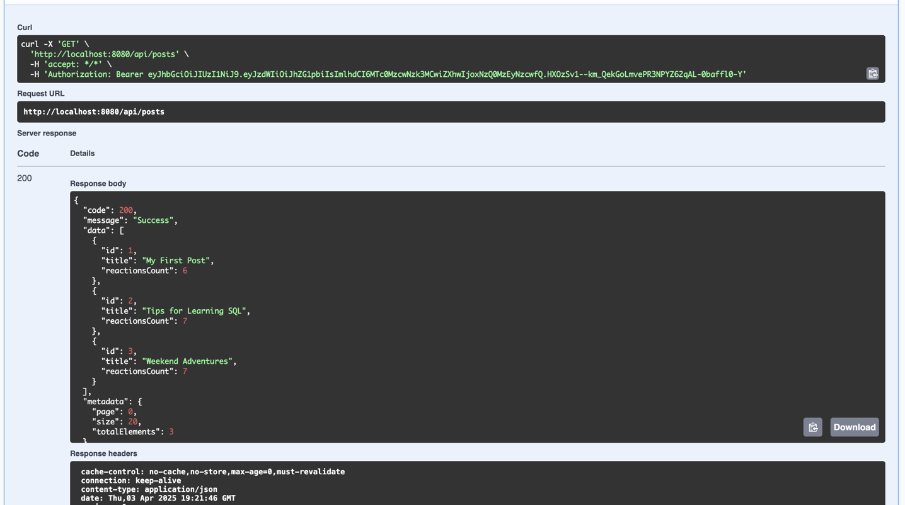

# Blog Service Java

The Java service serves as a REST API for social network allowing CRUD operations
on posts and reactions. Also, it includes authentication and authorization functionality
using a JWT token.

## Screenshots

## Installation

1. Clone repository `git clone https://github.com/Vladosik12333/blog-service-java`
2. Create env file for secrets `touch .env`
3. Put in env file: DB_URL, DB_USER, DB_PASSWORD, DB_NAME, JWT_TOKEN_SECRET
4. Run docker compose `docker-compose up`
5. Open [swagger](http://localhost:8080/api/swagger-ui/index.html) to test the service
6. In case of testing from Postman,
   import [Postman collection](blog-service-java.postman_collection.json)
7. Use GET /health-check/ping expecting response "Success" 200 to verify the service running

> Use login "admin" and password "admin" to log in.

## Technologies

## Authors

[Vladyslav Babiak - Developer](https://github.com/Vladosik12333)

## Copyright & Licensing Information

[MIT License](LICENSE)
